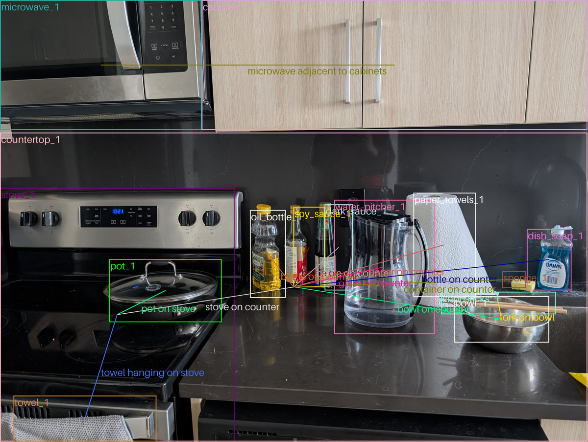

# kalman-filter-scene-graph

Scene graphs are generated for an image to describe the objects and relationships between the. Objects (eg. "table") are represented as nodes with attributes (eg. "wooden"), and relationships (eg. "beside", "holding") are the edges between nodes.



This project was developed on Windows using Git Bash.

## Local Setup

Get a Gemini API key to `.env`:

```
GOOGLE_API_KEY=<your_api_key>
```

Set up a virtual environment:

```{bash}
# create a venv
python -m venv .venv
. .venv/Scripts/activate

# set up venv as jupyter kernel
pip install jupyter ipykernel
python -m ipykernel install --user --name=kalman-filter-scene-graph --display-name "Python (kalman-filter-scene-graph)"

# install required packages (local setup)
pip install -r requirements.txt
```

Select kernel -> Jupyter -> Python (kalman-filter-scene-graph)

## Todo

- Compare performance when uploading different resolutions of the image
    - Find optimal resolution to reduce upload/process time without sacrificing performance
