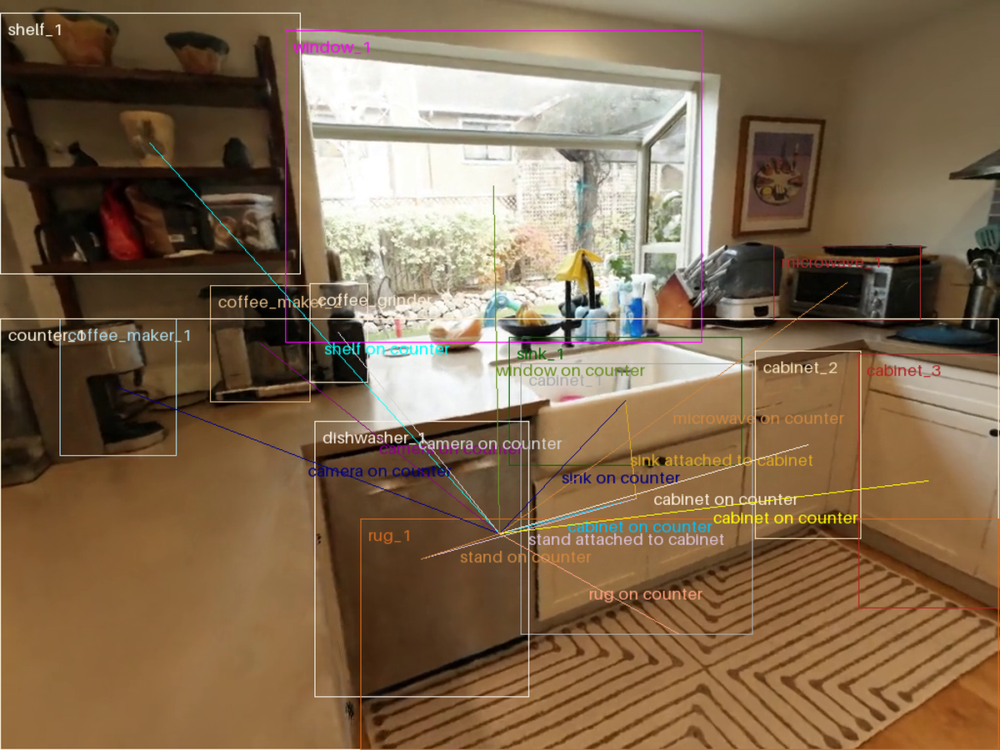

# Application of Kalman Filter to LLM-Based Dynamic Scene Graph Generation

# Abstract

# Background

## Scene Graphs

Scene graphs are descriptions of images in the form of graphs. Each node in the scene graph represents an object instance identified in the image along with its bounding box, and may also include attributes that describe its quality (eg. color, material). Edges are drawn between any two objects that have an identifiable relationship. For example, a table can be next to a chair, or a person can throw a ball. Altogether, a scene graph provides a clear representation that demonstrates a semantic understanding of the image.

Dynamic scene graphs extend this idea to a video. Interpreting a video as a sequence of frames, we can generate an independent scene graph for each frame. However, we expect that from frame to frame, a scene graph may not change drastically as there is an aspect of temporal and spatial consistency. In particular, from frame to frame, although the scene may not have changed, we might have a problem of inconsistent recognition of objects (objects appearing or disappearing from the graph when it is still in frame), and mislabelling of objects, attributes, or relations. As such, our goal is to produce a sequence of scene graphs corresponding to frames of a video that are consistent with each other.

## Kalman Filter

Kalman filter is an algorithm that stabilizes a signal derived from noisy measurements over time. It is based on a user-defined dynamic model that is used to form an estimate of the true signal as measurements are accumulated.

One illustrative example of Kalman filter is its application in voltage measurement. Given a sequence of noisy voltage readings of a battery, Kalman filter can be applied to stabilize the signal over time and converge to the underlying voltage value.

The algorithm essentially steps through time steps $k$, collecting a measurement at each step and calculating a state estimate based on a previously stored internal state and the dynamic model defined by the developer.

Algorithm variables
- $z_k$ noisy external measurement.
- $\hat x_k$ state estimate.
- System model: defined by the developer according to the task at hand
    - $A$ an approximate linear model defining the dynamics of the system.
    - $H$ maps measurements to states.
    - $Q$ a diagonal matrix related to the level of noise in the process (from one state to the next).
    - $R$ a diagonal matrix related to the level of measurement noise.
- Variables used in internal computation
    - $\hat x_k^-$ the predicted state using the previous state.
    - $\hat P_k^-$ the predicted error covariance (uncertainty in the predicted state).
    - $K_k$ Kalman gain, how much weight to give a new measurement compared to the estimate.

Algorithm steps
- Estimation step: integrates a new measurement into an estimation of the current state.
    - $\hat x_k = \hat x_k^- + K_k (z_k - H \hat x_k^-)$
        - This adjusts the estimated state for this time step based on the observation.
        - $H \hat x_k^-$ is the predicted measurement.
        - We take the difference between the true and predicted measurements and scale it by the Kalman Gain $K_k$.
        - Note that this can be rearranged to obtain an equation of the form of a low-pass filter, which is like a moving average with a decaying weight based on time.
            - Low-pass filter: $\bar x_k = \alpha \bar x_{k-1} + (1-\alpha) x_k$
    - $K_k = P^-_k H^T (H P_k^- H^T + R)^{-1}$
        - Calculates the Kalman Gain, a measure of uncertainty for this estimate.
        - $H P_k^- H^T$ state uncertainty mapped to the measurement space.
        - Think of it as a numerator $P^-_k H^T$ and denominator $H P_k^- H^T + R$.
        - If measurement noise $R$ is large, then $K_k$ is small (less trust in new measurements).
        - If state uncertainty $P^-_k$ is large, then $K_k$ is large.
            - Try plotting $f(x) = \frac{x}{x+1}$. For $x \geq 0$, we have $f(0) = 0$ and $\lim_{x \to \infty} f(x) = 1$. Note that $f(x)$ is a strictly increasing function.
    - $P_k = P_k^- - K_k H P_k^-$
        - The error covariance $P_k$ is a measure of the inaccuracy of the estimate. Here, we scale it based on how much we trust the current state.
- Prediction step: predict what we think the next state should be.
    - $\hat x_{k+1}^- = A \hat x_k$
        - Predicts the next state using the defined dynamics model $A$.
    - $P^-_{k+1} = AP_kA^T + Q$
        - Estimates the level of noise for the next time step using process noise.

# Glossary

**Dynamic Scene Graph Generation**  
**Panoptic Video Scene Graph Generation (PVSGG)**  
**Scene Graph Generation (SGG)**  
**Spatio-Temporal Scene Graph Generation (ST-SGG)**  
**Video Scene Graph Generation (VidSGG)**

# Literature Review

## Dynamic Scene Graphs

**Temporally Consistent Dynamic Scene Graphs: An End-to-End Approach for Action Tracklet Generation**  
[https://arxiv.org/html/2412.02808v1](https://arxiv.org/html/2412.02808v1)

- Uses bipartite matching, feedback loops  
- Solve PVSGG (Panoptic Video Scene Graph Generation)

## Kalman Filter

**SAMURAI: Adapting Segment Anything Model for Zero-Shot Visual Tracking with Motion-Aware Memory**  
[https://arxiv.org/abs/2411.11922](https://arxiv.org/abs/2411.11922)  
SAM 2 (Segment Anything Model 2\) is a model with strong object segmentation capabilities. SAMurai builds on it to extend its performance in object tracking.

The architecture of SAM 2 is vaguely as follows. The prompt encoder takes encodes prompts in the form of sparse (eg. points, bounding boxes) or dense (eg. masks) descriptions of objects in the image. The memory attention layer performs self-attention with these embeddings and cross-attention with embeddings and the memory bank. The mask decoder takes the result from the memory attention layer to generate a set of predicted masks each with a corresponding mask score (confidence in the mask), and object score (confidence in the object’s existence). We select the prediction with the best score. The memory encoder generates a memory from the selected mask and stores it in the memory bank.

SAMurai adds a motion modeling unit before selecting a mask prediction. This unit adds an additional component to the metric using the result from Kalman filter’s model: for each object, we can model its motion using a state consisting of the location and velocity in the image. The Kalman filter model can produce a prediction for the next frame, which we use to check each mask against; we use the IoU score between the Kalman filter prediction and each mask to represent some measure of motion consistency within the image.

**Graph Kalman Filters**  
[https://arxiv.org/abs/2303.12021](https://arxiv.org/abs/2303.12021)

# Empirical Exploration

## Directly Prompting LLMs

**Method**  
LLMs can be prompted out of the box to generate scene graphs. To explore the capabilities of an LLM-only system, I prompted Gemini to generate scene graphs for frames of a video.

For this exploration, I used Gemini Flash through the Gemini API to generate a scene graph for a given image in JSON format. The exact prompt used can be found in the linked Google Colab notebook. With the text prompt, I included the image for which to generate the scene graph, as well as a JSON object containing IDs for object categories, attributes, and relations. The model is requested to refer to these IDs when classifying objects, attributes, and relations.

Note that there are some hoops to jump through when dealing with scene graphs with Gemini – the model seems to return scaled coordinates between (0, 1000\) in the form (Y, X). As such, any coordinates returned must be rescaled before plotting.

**Results**  
Below I have included the scene graphs produced for 3 frames of a sample video taken from ZipNeRF. It is a video of a static scene.

**Discussion**  
Gemini seems to be able to generate a basic scene graph.  
SGG

- It can draw rough bounding boxes around objects, though they are often not very accurate.  
- It does not identify all objects in the image, though perhaps a more refined prompt could extract more objects.  
- Relationships between objects are sometimes correctly identified but don’t always make sense (eg. “cabinet on counter”, when the cabinet is clearly under the counter).

DSGG

- Objects are not consistently tracked across frames – for example, the picture frame in the top right of each of the frames is identified only in the second frame.  
- Expanding on the previous point, objects are not consistently identified in the same way either; the cabinets are a mess.

**Next Steps**

# Resources and Links

Google Colab Notebook [https://colab.research.google.com/drive/18MUZArlQFvTPRz-B4Wz0t79cz\_aji8fl](https://colab.research.google.com/drive/18MUZArlQFvTPRz-B4Wz0t79cz_aji8fl)  
ZipNeRF [https://jonbarron.info/zipnerf/](https://jonbarron.info/zipnerf/)  
